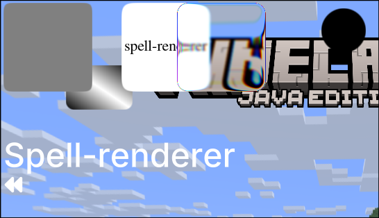

# Spell Renderer

A fast, lightweight OpenGL wrapper for Minecraft, designed for rendering 2D objects with a clean, fluent API.



## Features

- **Shape builder** - chainable API for positioning, sizing, coloring, and rounding.
- **Batched rendering** - shapes of the same type are merged into a single draw call.
- **Custom shaders** - dedicated shader programs for rectangles, images, text, and glass.
- **MSDF text rendering** - crisp text at any scale via signed distance field fonts.
- **Glass effect** - frosted/blurred panel rendering for modern UI looks.
- **DPI scaling** - ability to change scale of the elements.
- **Render Context** - different context for different scenarios: GUI, HUD. (WORLD is in development!)`
- **Scissors** - ability to set a region and draw without going out of its bounds.

## Requirements

- Minecraft: `1.21.8`
- Fabric Loader: `>=0.18.5`
- Fabric API: `0.136.1+1.21.8`
- Java: `21`

## Installation

### Gradle
```gradle
repositories {
    maven { url = "https://api.modrinth.com/maven" }
}

dependencies {
    modImplementation "maven.modrinth:spell-renderer:26.3"

    // Optional: bundle Spell Renderer inside your mod JAR
    // so users don't need to install it separately.
    include "maven.modrinth:spell-renderer:26.3"
}
```

### Maven
```maven
<repositories>
    <repository>
        <id>modrinth</id>
        <url>https://api.modrinth.com/maven</url>
    </repository>
</repositories>

<dependencies>
    <dependency>
        <groupId>maven.modrinth</groupId>
        <artifactId>spell-renderer</artifactId>
        <version>26.3</version>
    </dependency>
</dependencies>
```

### fabric.mod.json
```json
"depends": {
  "spell-renderer": "26.3"
}
```

## Usage

### Initializing:

```java
    @Override
    public void onInitializeClient() { // SpellRenderer.on() SHOULD ONLY BE CALLED FROM THIS METHOD!
        Spellrenderer.on(RenderContext.GUI, () -> {  // GUI context - rendered on top of everything.
            // You can draw inside the listener.
            Builder.rect()
                    .pos(15, 15, 10)
                    .size(100, 75)
                    .radius(8)
                    .color(Color.WHITE)
                    .submit();
        
            // Or (Recommended way)
            EventBus.post(new RenderGUIEvent()); // Use an eventbus and post events for each context.
        });
    }
```

### Adding icons & fonts

**Icons - are the same atlas + json msdf fonts. The only difference additional `"names"` json object.**

**1.** Generate msdf atlas + json.

You can generate them using Chlumsky's [MSDF Atlas Generator](https://github.com/Chlumsky/msdf-atlas-gen).

Recomended flags:
```shell
-font ExampleFont.ttf -charset charset.txt -type msdf -size 48 -pxrange 4 -format png -imageout ExampleFont.png -json ExampleFont.json
```

**2.** For icons add `"names": {"name": unicode}` to your font's json.

```jsonc
{
  "atlas":{"type":"msdf","distanceRange":4,"distanceRangeMiddle":0,"size":48,"width":84,"height":84,"yOrigin":"bottom"},
  "metrics":{"emSize":1,"lineHeight":1.0900000000000001,"ascender":0.84999999999999998,"descender":-0.14999999999999999,"underlineY":0.01,"underlineThickness":0},
  "glyphs":[{"unicode":65,"advance":1,"planeBounds":{"left":0.0020833333333333199,"bottom":-0.052083333333333336,"right":0.8979166666666667,"top":0.76041666666666663},"atlasBounds":{"left":0.5,"bottom":44.5,"right":43.5,"top":83.5}}],
  "kerning":[],
  "names": {
    "backward": 65   // "name": unicode
  }
}
```

**3.** Init inside the code.

```java
ClientLifecycleEvents.CLIENT_STARTED.register(client -> { // ONLY THIS EVENT. NOT onInitializeClient()!
    FontManager.load("key", ResourceLocation.fromNamespaceAndPath("Your mod id", "fonts/inter"));
    // WRITE THE FILE NAME WITHOUT THE EXTENSION e.g. fonts/inter.png -> fonts/inter
});
```

### Available shapes

| Shape    | Description                                 |
|----------|---------------------------------------------|
| `rect`   | Rounded rectangle with per-corner colors    |
| `circle` | Filled circle                               |
| `image`  | Textured quad with optional rounded corners |
| `text`   | SDF-rendered string                         |
| `glass`  | Frosted-glass blurred panel                 |
| `icon`   | Mapped name parcing for icon fonts          |

## License

[MIT](LICENSE)

## TODO

1. Implement kernings
3. Implement 3d world rendering
4. Glass blur improvements
